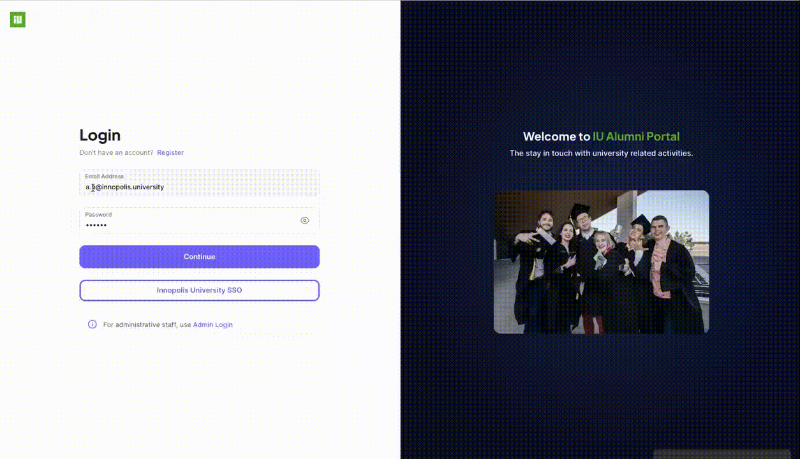
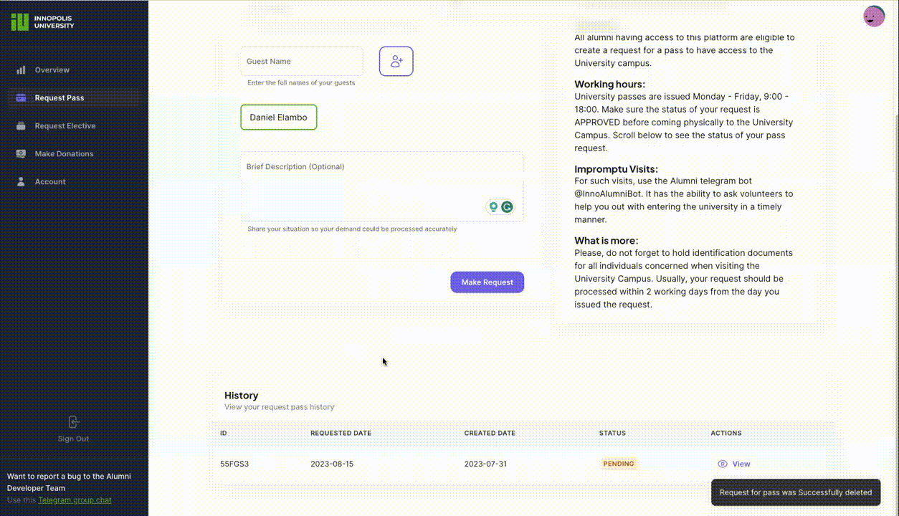
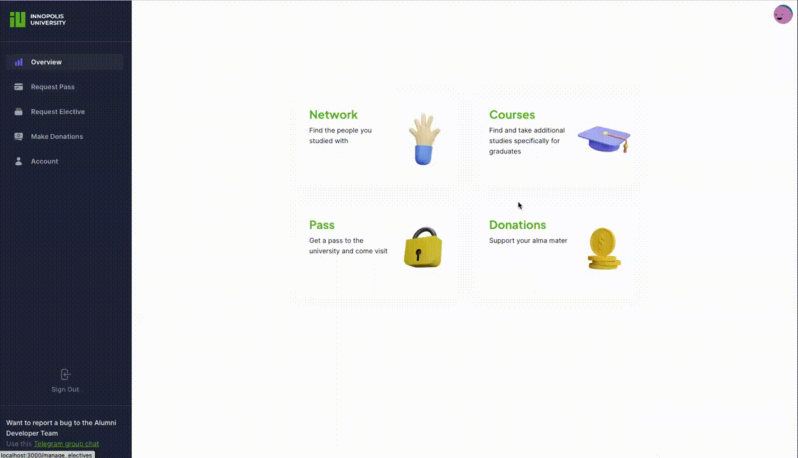
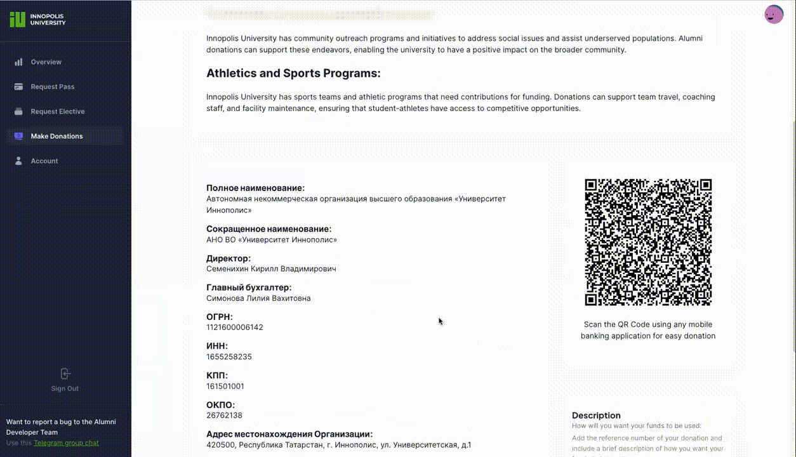

+++
title = 'Key Features'
weight = 20
+++

## Key Features

1. **_Customer Complaints_**: Customers can submit complaints directly through the telegram group mentioed on the website.
2. **_Users Data Management_**: Admins are able to accept or deny requests from users with feedback (on reasons for example)
3. **_Pass Order_**: Alumni users can request a pass to enter the university for different purposes from the main page of the website
4. **_Elective Courses Participation Requests_**: Alumni users can request to attend elective courses held in the university at the time they are applying.

## Instructions

### Login process:

### Donations:

### Request electives:

### Request pass:

### Logout process:

## Full demo
